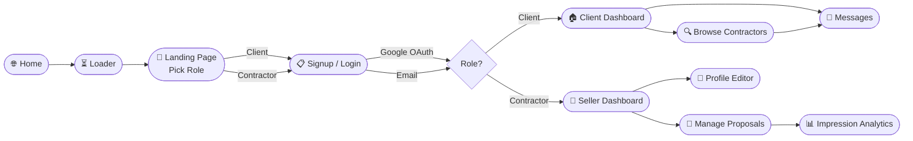
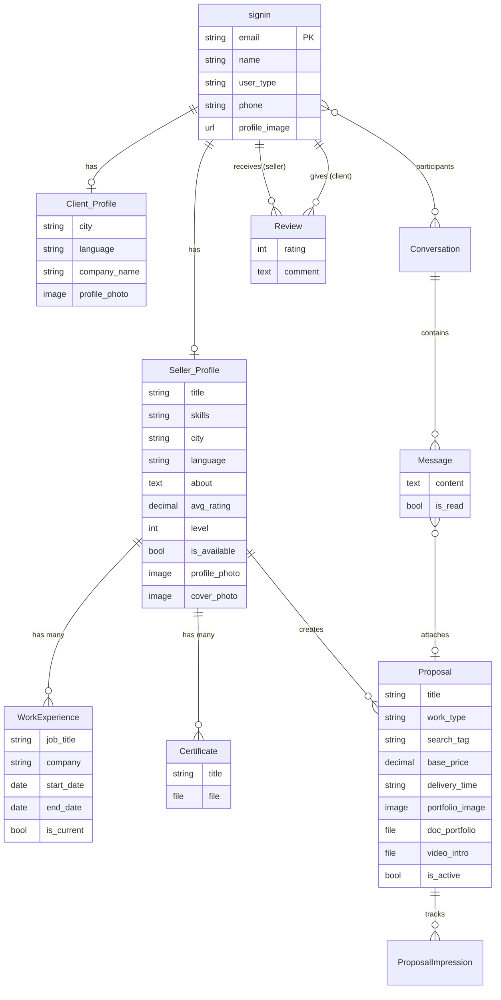
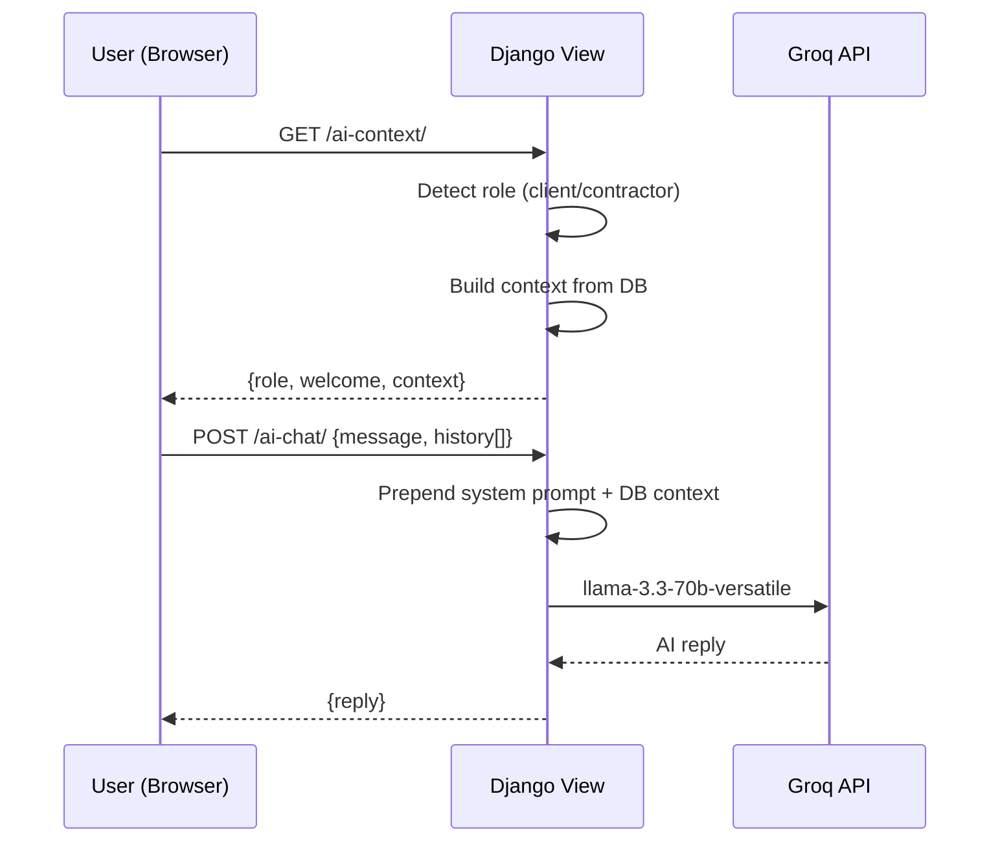

<div align="center">


<br/>

[](https://djangoproject.com)
[](https://python.org)
[](https://groq.com)
[](https://developers.google.com)

<br/>

**ContractorHub** connects clients with skilled contractors (plumbers, electricians, painters & more) across Pakistan — with role-based dashboards, real-time messaging, AI-powered matching, and proposal analytics.

</div>

---

## 🗺️ User Flow



---

## 🗄️ Database Schema



---

## 🤖 AI Assistant Architecture



> **Client AI** → recommends best contractors from live DB data  
> **Seller AI** → coaches on profile quality, proposals, pricing strategy

---

## 📁 Pages & Routes

| Template | URL | Access | Status |
|---|---|---|---|
| `landingpage.html` | `/landing_page/` | Public | ✅ |
| `login.html` | `/login/` `/signin/` | Public | ✅ |
| `client.html` | `/client/` | Login Required | ✅ |
| `show_seller.html` | `/show_seller/` | Login Required | ✅ |
| `seller.html` | `/seller/` | Login Required | ✅ |
| `profile_seller.html` | `/seller/profile/` | Login Required | ✅ |
| `proposal.html` | `/seller/proposal/create/` | Login Required | ✅ |
| `active_work.html` | `/proposals/` | Login Required | ✅ |
| `messages.html` | `/messages/` | Login Required | ✅ |
| `profile_view.html` | `/profile/<id>/` | Login Required | ✅ |
| `client_profile.html` | `/client/profile/` | Login Required | ✅ |
| `admin.html` | `/myadmin/` | Admin | ⚠️ UI only |
| `home.html` `faqs.html` `about_us.html` `privacy.html` | various | Public | ✅ |

---

## ⚙️ Tech Stack

| Layer | Technology |
|---|---|
| Backend | Django 5, Python 3.11 |
| Auth | Django Auth + Google OAuth (allauth) |
| AI | Groq API — LLaMA 3.3 70B Versatile |
| Frontend | HTML, CSS (custom vars), Vanilla JS |
| Charts | Chart.js (impression analytics) |
| Storage | Django FileField / ImageField → `/media/` |
| Maps | Nominatim reverse geocoding (client-side) |
| DB | SQLite (dev) → PostgreSQL (prod) |

---

## 🚀 Setup

```bash
# 1. Install dependencies
pip install django django-allauth groq python-dotenv Pillow

# 2. Create env.env in project root
SECRET_KEY=your-secret-key
GROQ_API=gsk_your_groq_key
GOOGLE_CLIENT_ID=...
GOOGLE_CLIENT_SECRET=...

# 3. Run migrations
python manage.py makemigrations && python manage.py migrate

# 4. Start server
python manage.py runserver
# Visit → http://localhost:8000/loader/
```

---

## 🔐 Security Status

| Feature | Status |
|---|---|
| CSRF Protection on all forms | ✅ |
| `@login_required` on all sensitive views | ✅ |
| Role-based redirect enforcement | ✅ |
| Conversation access control | ✅ |
| Strong password validation | ✅ |
| Review self-submission blocked | ✅ |
| Rate limiting on login/AI endpoints | ❌ Needed |
| `/myadmin/` auth guard | ❌ Needed |
| File upload type/size validation | ❌ Needed |
| Email verification on signup | ❌ Needed |
| HTTPS enforcement (production) | ❌ Needed |

---

## 🛣️ Roadmap

- [ ] Admin panel backend (user management, moderation, stats)
- [ ] Notification system (new message, new review, new view)
- [ ] Payment integration (JazzCash / EasyPaisa)
- [ ] WebSocket real-time messaging (replace 5s polling)
- [ ] Email verification + password reset
- [ ] Rate limiting on auth + AI endpoints
- [ ] Distance-based contractor discovery

---

## 📸 Screenshots

| Landing Page | Client Dashboard | Seller Dashboard |
|:---:|:---:|:---:|
|  |  |  |

| Messages | Profile Editor |
|:---:|:---:|
|  |  |

---

<div align="center">


Made with ❤️ for Pakistan's Construction Industry

</div>
